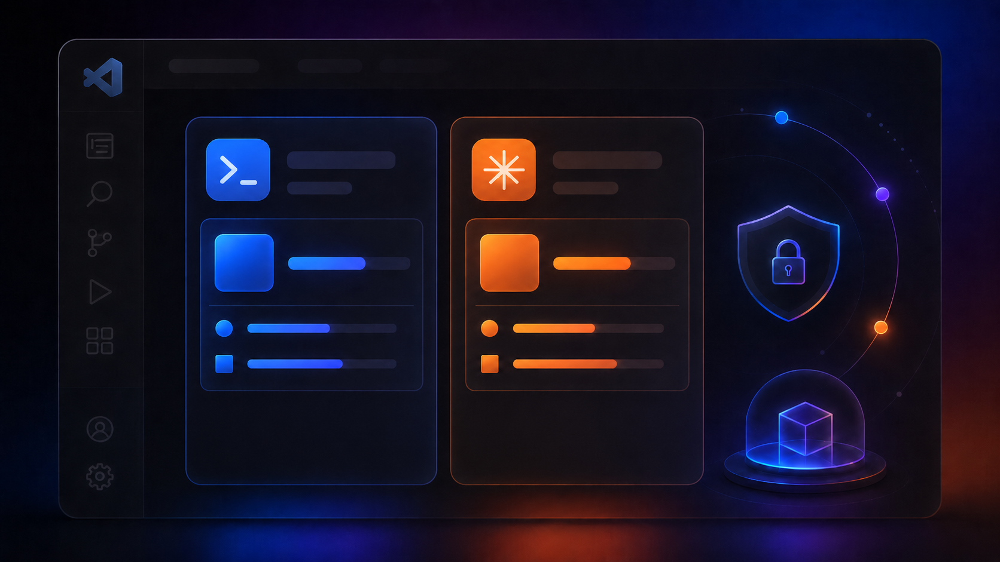
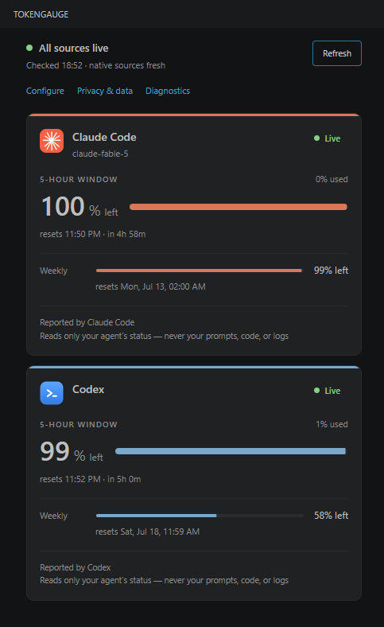

# TokenGauge

> **A privacy-first, native-first cockpit for AI coding tool status inside VS Code.**
> TokenGauge shows provider-reported usage, limits, reset windows, availability,
> and cost when local tools expose those signals. Every metric is tracked with
> source and accuracy metadata, surfaced in plain language, and missing or stale
> data is shown plainly.

**Status: publicly available through the Visual Studio Marketplace and GitHub
Releases.** TokenGauge is early-stage, actively maintained, and Apache-2.0
licensed.



TokenGauge is a VS Code extension for developers who use AI coding tools such as
Claude Code and Codex. It reads native provider status from local tool surfaces,
tracks each metric's source and accuracy, and reports unavailable, unknown,
stale, degraded, or disabled states without scraping logs, prompts, completions,
or transcripts.

### Why TokenGauge

- **Honest by construction.** Every number is tracked with an accuracy label — current v1 emits `proxy_reported` (native-reported) or `unknown`; see [ACCURACY.md](ACCURACY.md) for the full declared taxonomy. Cards surface the label as plain-language provenance, and Cockpit Diagnostics exposes the raw labels. Missing cost reads `cost unknown`, never a believable `$0.00`.
- **Native-first.** The cockpit reads current limit state from native agent surfaces. It does **not** need your conversation logs to work, and reads none by default.
- **Privacy-first.** Local-only. No developer-controlled telemetry, no default outbound network calls, no prompts/completions/source/secrets ever read or stored.
- **Multi-agent.** Claude Code and Codex native cockpit cards today; an adapter contract lets more sources be added without core changes.
- **Clear limits.** Track per-agent 5h and weekly windows, reset timing, and context where exposed, with each gauge's risk state shown via text + color (not color alone).



## Requirements and supported setups

**What you need**

- VS Code 1.95 or newer, local or remote (WSL, Remote-SSH, Dev Containers; see the Remote section below).
- For the Claude card: Claude Code running as a **CLI** in a terminal (any terminal, including the VS Code integrated terminal), plus a small statusLine writer script. The primary setup below uses a Node.js writer so it does not need `jq`, `sha256sum`, `chmod`, or a shell-script shebang.
- For the Codex card: the Codex CLI installed and signed in on the same side as TokenGauge, plus the explicit probe opt-in. Codex support is experimental and limited to the short and weekly app-server usage-window shapes this TokenGauge version recognizes.

**Terminal vs. VS Code extension sessions**

- **Claude Code:** the Claude card is fed by Claude Code's statusLine feature, which runs in CLI terminal sessions. Sessions run through the Claude Code VS Code extension's graphical panel do not run statusLine commands, so they never refresh the snapshot. Panel usage still counts toward the same account 5h/weekly limits, and it shows up in TokenGauge as soon as any CLI session reports a fresh sample. TokenGauge never reads the panel's internal state.
- **Codex:** the opt-in probe asks your local `codex app-server` for account-level rate-limit windows as reported by that local app-server. It does not attach to or inspect an active Codex terminal or IDE chat session, and it is not a Codex API billing or cost meter.

**Plans and API accounts**

- Claude Code reports the 5h/weekly `rate_limits` statusLine fields only for Claude.ai subscription (Pro/Max) sessions, and only after the session's first response. API-key, Console, or third-party-provider usage may never produce those fields; the Claude card then shows an honest waiting/incomplete state. That is expected behavior, not a fault.
- Different subscription tiers only change how fast the same percentages move. TokenGauge displays exactly the provider-reported percentages; it never knows or guesses a plan's absolute quota.
- Codex support is experimental and opt-in. TokenGauge asks the local `codex app-server` for account rate-limit information. Codex may report a short usage window, a weekly usage window, or both; TokenGauge displays the recognized windows, promotes Weekly to the primary meter when the short window is absent, and does not fabricate omitted values. If your Codex version, plan, login mode, API-key setup, or app-server response reports neither recognized window, TokenGauge shows Codex as unavailable or unsupported instead of guessing.

TokenGauge visualizes limits. It never enforces them, blocks requests, or sends alerts.

## Will this work for my setup?

| Setup | TokenGauge behavior |
|-------|---------------------|
| Claude Code CLI with statusLine | Supported when your statusLine writer produces the documented snapshot. |
| Claude Code VS Code graphical panel only | Not read directly. Panel usage may count toward account limits, but TokenGauge updates only when a CLI statusLine snapshot is written. |
| Codex CLI/app-server | Experimental, opt-in, and limited to recognized short and weekly account-window responses. |
| Codex API-key or unrecognized bucket shapes | May be unavailable or unsupported; TokenGauge does not guess or show Codex cost. |
| Terminal text or inline status lines | Not scraped for either provider. |
| Multiple Codex sessions | Not session-tracked; the Codex card shows account-level rate-limit windows reported by the local app-server. |

## Quick start

After installing, TokenGauge activates automatically; no reload is needed. You
get a **TokenGauge icon in the Activity Bar** (the cockpit view lives there) and
a `TG:` status bar item that opens the cockpit on click. The cockpit opens with
setup, unavailable, or incomplete states by default. Live usage-window gauges require
a configured Claude statusLine snapshot and/or the explicit Codex probe opt-in.
The local Claude `stats-cache.json` cache (per-model cost and model info) is
read only when the Claude card is visible, as described under [Sources](#sources).

1. After installing TokenGauge, run **TokenGauge: Open Cockpit** from the Command Palette.
2. Run **TokenGauge: Configure Cockpit** and choose **Claude settings** or
   **Codex settings**. Configure Cockpit groups provider setup and card
   visibility together, opens filtered Settings pages, and never changes a value
   for you.
3. For Claude Code, follow the **[Claude Code setup](#claude-code-setup)**
   section below. In short: point `tokenGauge.claude.statuslineSnapshotPath` at
   a per-session snapshot directory (recommended for multiple sessions), or at a
   single snapshot file for one active statusLine writer.
4. For Codex, leave `tokenGauge.providers.codex.nativeStatusProbe` off unless
   you explicitly opt in. You can turn it on from Configure Cockpit or Settings;
   TokenGauge does not ask for API keys or provider secrets. When the probe is
   enabled and the Codex card is visible, TokenGauge performs a fresh check when
   it activates. Turning the probe off clears displayed Codex status and stops
   future probes without changing your setting for you.

TokenGauge shows honest unavailable, stale, disabled, and degraded states while
native status is missing or waiting for fresh data. It does not parse logs,
prompts, completions, transcripts, or terminal output, does not synthesize usage
estimates, sends no telemetry, and makes no default outbound network calls.

Provider cards are display-only preferences:

- `tokenGauge.display.cards.claude.visible` (default `true`)
- `tokenGauge.display.cards.codex.visible` (default `true`)

Hidden cards are omitted from the cockpit and status bar summaries. Hiding the
Claude card stops Claude statusLine and `stats-cache.json` reads. Hiding the
Codex card stops Codex app-server probes, even if
`tokenGauge.providers.codex.nativeStatusProbe` remains enabled. If both cards
are hidden, the cockpit shows **No cards visible** with configuration links.

## Claude Code setup

Prefer a platform walkthrough? See the
[Windows (PowerShell) setup guide](docs/setup/windows.md) or the
[Remote WSL setup guide](docs/setup/wsl.md) — this section remains the
canonical writer source either way.

TokenGauge's Claude card reads a small **snapshot file** that a short **writer
script** produces. You write that script once, tell Claude Code to run it, and
tell TokenGauge where to read its output. TokenGauge never edits your Claude
config, never runs this Claude writer script itself, and reads no conversation
logs.

The statusLine feature runs in Claude Code **CLI terminal sessions**; sessions
in the Claude Code VS Code extension's graphical panel do not run it (see
[Requirements and supported setups](#requirements-and-supported-setups)).

### How it fits together

There are **two separate paths**, and it helps to keep them straight:

1. **Writer script path**: the shell script *Claude Code* runs.
2. **Snapshot output path**: the JSON file (or directory) *TokenGauge* reads.

They are not the same file. Claude Code runs the writer script; the writer script
writes the snapshot; TokenGauge reads the snapshot. In sequence:

```
Claude Code statusLine event
  → Claude Code runs your writer script           (via statusLine.command)
  → Claude Code sends status JSON to it on stdin
  → the script writes the snapshot JSON           (and may print a line back for Claude's own status bar)
  → TokenGauge reads the configured snapshot path (via tokenGauge.claude.statuslineSnapshotPath)
```

So Claude Code is what *runs* the script on every statusLine refresh, and
TokenGauge only ever *reads* the snapshot the script leaves behind.

### The two paths at a glance

| Path (example) | Set in | Who uses it | What it is |
|----------------|--------|-------------|------------|
| `~/.tokengauge/claude/claude-statusline-writer.mjs` | Claude Code `statusLine.command` | Claude Code **runs** it with `node` | the writer script Claude Code executes on each statusLine event |
| `~/.tokengauge/claude/statusline-snapshot.json` | TokenGauge `tokenGauge.claude.statuslineSnapshotPath` | TokenGauge **reads** it | the JSON the script writes (*single-file mode*) |
| `~/.tokengauge/claude/statusline-snapshots/` | TokenGauge `tokenGauge.claude.statuslineSnapshotPath` | TokenGauge **reads** it | a folder holding one snapshot per Claude session (*directory mode*) |

The main setup below uses those default paths so every command is
copy-paste-safe. Advanced users can choose other paths, but then both Claude
Code and TokenGauge settings must be updated to match. For statusLine data,
TokenGauge reads only the one path you configure; it does not scan `.claude`
roots or parse logs. Independently of that path it also reads one fixed local
file, `~/.claude/stats-cache.json` (Claude Code's own usage cache, read for
per-model cost and model info; see [Sources](#sources)).

### 1. Create the writer script

Claude Code must already run in the same environment where this writer runs. If
`claude` does not start in that environment, fix Claude Code first, then return
to TokenGauge. Run `node --version` in that same environment before creating
the writer. If `node` is not found there, install Node.js or use a custom writer
that emits the documented JSON snapshot. TokenGauge does not install Node or Claude Code.

The examples below create this writer:

- Writer script: `~/.tokengauge/claude/claude-statusline-writer.mjs`
- Snapshot JSON: `~/.tokengauge/claude/statusline-snapshot.json`

Claude Code `statusLine.command` runs the writer script with Node. TokenGauge
reads the snapshot JSON. Do not set TokenGauge's snapshot path to the writer
script. The writer does not hard-code an output path; pass either `--file` for a
single snapshot file or `--dir` for one snapshot per Claude session.

The script keeps **only** the safe, allowlisted fields (5h/weekly percentages
and reset times, model id, optional cost and context, plus a capture timestamp
and **hashed** session/workspace identifiers), never raw paths, raw session ids,
prompts, or transcripts. The hashed identifiers let TokenGauge tell two
sessions apart safely; without them the multiple-writers warning described below
cannot appear. The script also prints a short line to stdout, because Claude
Code displays the first stdout line of your statusLine command (without it your
Claude status line would be blank). It uses Node's built-in JSON parser and
SHA-256 hashing, so no `jq`, `sha256sum`, `chmod`, or `sed` step is needed.

#### WSL, Linux, macOS, or Git Bash

Use this block in Bash-like shells only. It is not PowerShell syntax.

```bash
mkdir -p ~/.tokengauge/claude

cat > ~/.tokengauge/claude/claude-statusline-writer.mjs <<'TOKENGAUGE_STATUSLINE'
import { createHash } from 'node:crypto';
import { existsSync, lstatSync, mkdirSync, renameSync, rmSync, writeFileSync } from 'node:fs';
import { basename, dirname, join, resolve } from 'node:path';
import { argv, stderr, stdin, stdout } from 'node:process';

// TOKENGAUGE_STATUSLINE_WRITER_START
const ERROR_PREFIX = 'TokenGauge statusline writer error:';
const HASH_MISSING_VALUE = 'none';

class UserError extends Error {
  constructor(message, code = 1) {
    super(message);
    this.code = code;
  }
}

function fail(message, code = 1) {
  throw new UserError(message, code);
}

function parseArgs(args) {
  if (args.length !== 2) {
    fail('invalid arguments', 2);
  }

  const [mode, target] = args;
  if (mode !== '--file' && mode !== '--dir') {
    fail('invalid arguments', 2);
  }
  if (typeof target !== 'string' || target.length === 0 || target.includes('\0')) {
    fail('invalid target', 2);
  }

  return { mode, target: resolve(target) };
}

function hash16(value) {
  const text = typeof value === 'string' && value.length > 0 ? value : HASH_MISSING_VALUE;
  return createHash('sha256').update(text).digest('hex').slice(0, 16);
}

function safeString(value, max) {
  if (typeof value !== 'string' || value.length === 0 || value.length > max) {
    return undefined;
  }
  return value;
}

function pct(value) {
  return typeof value === 'number' && Number.isFinite(value) && value >= 0 && value <= 100
    ? value
    : undefined;
}

function nonnegativeNumber(value) {
  return typeof value === 'number' && Number.isFinite(value) && value >= 0 ? value : undefined;
}

function positiveInt(value) {
  return Number.isInteger(value) && value > 0 ? value : undefined;
}

function nonnegativeInt(value) {
  return Number.isInteger(value) && value >= 0 ? value : undefined;
}

function compact(value) {
  if (Array.isArray(value)) {
    const items = value.map(compact).filter((item) => item !== undefined);
    return items.length > 0 ? items : undefined;
  }
  if (value && typeof value === 'object') {
    const result = {};
    for (const [key, item] of Object.entries(value)) {
      const next = compact(item);
      if (next !== undefined) result[key] = next;
    }
    return Object.keys(result).length > 0 ? result : undefined;
  }
  return value === undefined || value === null ? undefined : value;
}

function rateLimitWindow(input) {
  if (!input || typeof input !== 'object') return undefined;
  return compact({
    used_percentage: pct(input.used_percentage),
    resets_at: nonnegativeInt(input.resets_at),
  });
}

function buildSnapshot(data) {
  if (!data || typeof data !== 'object') {
    fail('invalid payload');
  }

  const modelId = safeString(data.model?.id, 120) ?? safeString(data.model?.display_name, 120);
  if (modelId === undefined) {
    fail('invalid payload');
  }

  const workspacePath =
    safeString(data.workspace?.project_dir, 4096) ??
    safeString(data.workspace?.current_dir, 4096) ??
    safeString(data.cwd, 4096);

  return compact({
    source: 'claude_statusline',
    timestamp: new Date().toISOString(),
    provider: 'anthropic',
    agent: 'claude-code',
    session_id_hash: hash16(data.session_id),
    workspace_hash: hash16(workspacePath),
    model: {
      id: modelId,
      display_name: safeString(data.model?.display_name, 120),
    },
    cost: {
      total_cost_usd: nonnegativeNumber(data.cost?.total_cost_usd),
    },
    rate_limits: {
      five_hour: rateLimitWindow(data.rate_limits?.five_hour),
      seven_day: rateLimitWindow(data.rate_limits?.seven_day),
    },
    context_window: {
      context_window_size: positiveInt(data.context_window?.context_window_size),
      used_percentage: pct(data.context_window?.used_percentage),
      remaining_percentage: pct(data.context_window?.remaining_percentage),
      total_input_tokens: nonnegativeInt(data.context_window?.total_input_tokens),
      total_output_tokens: nonnegativeInt(data.context_window?.total_output_tokens),
    },
    exceeds_200k_tokens:
      typeof data.exceeds_200k_tokens === 'boolean' ? data.exceeds_200k_tokens : undefined,
  });
}

function ensureDirectory(dir) {
  mkdirSync(dir, { recursive: true, mode: 0o700 });
  const stat = lstatSync(dir);
  if (stat.isSymbolicLink() || !stat.isDirectory()) {
    fail('invalid target');
  }
}

function rejectSymlink(path) {
  if (existsSync(path) && lstatSync(path).isSymbolicLink()) {
    fail('invalid target');
  }
}

function writeAtomic(finalPath, snapshot) {
  const dir = dirname(finalPath);
  ensureDirectory(dir);
  rejectSymlink(finalPath);

  const tmp = join(dir, `.${basename(finalPath)}.tmp-${process.pid}-${Date.now()}`);
  const body = `${JSON.stringify(snapshot, null, 2)}\n`;
  try {
    writeFileSync(tmp, body, { encoding: 'utf8', mode: 0o600, flag: 'wx' });
    renameSync(tmp, finalPath);
  } catch (error) {
    try {
      rmSync(tmp, { force: true });
    } catch {}
    if (error instanceof UserError) throw error;
    fail('write failed');
  }
}

function outputPathFor(mode, target, snapshot) {
  if (mode === '--file') {
    return target;
  }

  ensureDirectory(target);
  return join(target, `${snapshot.workspace_hash}-${snapshot.session_id_hash}.json`);
}

async function readStdin() {
  let input = '';
  stdin.setEncoding('utf8');
  for await (const chunk of stdin) {
    input += chunk;
    if (input.length > 1024 * 1024) {
      fail('invalid payload');
    }
  }
  return input;
}

async function main() {
  const { mode, target } = parseArgs(argv.slice(2));
  let payload;
  try {
    payload = JSON.parse(await readStdin());
  } catch (error) {
    if (error instanceof UserError) throw error;
    fail('invalid payload');
  }

  const snapshot = buildSnapshot(payload);
  writeAtomic(outputPathFor(mode, target, snapshot), snapshot);
  stdout.write('TokenGauge snapshot updated\n');
}

main().catch((error) => {
  const message = error instanceof UserError ? error.message : 'write failed';
  stderr.write(`${ERROR_PREFIX} ${message}\n`);
  process.exitCode = error instanceof UserError ? error.code : 1;
});
// TOKENGAUGE_STATUSLINE_WRITER_END

TOKENGAUGE_STATUSLINE

node --check ~/.tokengauge/claude/claude-statusline-writer.mjs
realpath ~/.tokengauge/claude/claude-statusline-writer.mjs
```

Use the absolute path printed by `realpath` in Claude Code's
`statusLine.command`. On Git Bash for Windows, that path may look like
`/c/Users/YOUR_USER/.tokengauge/claude/claude-statusline-writer.mjs`; use that
path with `node`.

#### PowerShell

Use this block in PowerShell. It avoids Bash here-docs, `~` in native command
arguments, and `realpath`.

```powershell
$writer = Join-Path $HOME ".tokengauge\claude\claude-statusline-writer.mjs"
New-Item -ItemType Directory -Force -Path (Split-Path $writer) | Out-Null

@'
import { createHash } from 'node:crypto';
import { existsSync, lstatSync, mkdirSync, renameSync, rmSync, writeFileSync } from 'node:fs';
import { basename, dirname, join, resolve } from 'node:path';
import { argv, stderr, stdin, stdout } from 'node:process';

// TOKENGAUGE_STATUSLINE_WRITER_START
const ERROR_PREFIX = 'TokenGauge statusline writer error:';
const HASH_MISSING_VALUE = 'none';

class UserError extends Error {
  constructor(message, code = 1) {
    super(message);
    this.code = code;
  }
}

function fail(message, code = 1) {
  throw new UserError(message, code);
}

function parseArgs(args) {
  if (args.length !== 2) {
    fail('invalid arguments', 2);
  }

  const [mode, target] = args;
  if (mode !== '--file' && mode !== '--dir') {
    fail('invalid arguments', 2);
  }
  if (typeof target !== 'string' || target.length === 0 || target.includes('\0')) {
    fail('invalid target', 2);
  }

  return { mode, target: resolve(target) };
}

function hash16(value) {
  const text = typeof value === 'string' && value.length > 0 ? value : HASH_MISSING_VALUE;
  return createHash('sha256').update(text).digest('hex').slice(0, 16);
}

function safeString(value, max) {
  if (typeof value !== 'string' || value.length === 0 || value.length > max) {
    return undefined;
  }
  return value;
}

function pct(value) {
  return typeof value === 'number' && Number.isFinite(value) && value >= 0 && value <= 100
    ? value
    : undefined;
}

function nonnegativeNumber(value) {
  return typeof value === 'number' && Number.isFinite(value) && value >= 0 ? value : undefined;
}

function positiveInt(value) {
  return Number.isInteger(value) && value > 0 ? value : undefined;
}

function nonnegativeInt(value) {
  return Number.isInteger(value) && value >= 0 ? value : undefined;
}

function compact(value) {
  if (Array.isArray(value)) {
    const items = value.map(compact).filter((item) => item !== undefined);
    return items.length > 0 ? items : undefined;
  }
  if (value && typeof value === 'object') {
    const result = {};
    for (const [key, item] of Object.entries(value)) {
      const next = compact(item);
      if (next !== undefined) result[key] = next;
    }
    return Object.keys(result).length > 0 ? result : undefined;
  }
  return value === undefined || value === null ? undefined : value;
}

function rateLimitWindow(input) {
  if (!input || typeof input !== 'object') return undefined;
  return compact({
    used_percentage: pct(input.used_percentage),
    resets_at: nonnegativeInt(input.resets_at),
  });
}

function buildSnapshot(data) {
  if (!data || typeof data !== 'object') {
    fail('invalid payload');
  }

  const modelId = safeString(data.model?.id, 120) ?? safeString(data.model?.display_name, 120);
  if (modelId === undefined) {
    fail('invalid payload');
  }

  const workspacePath =
    safeString(data.workspace?.project_dir, 4096) ??
    safeString(data.workspace?.current_dir, 4096) ??
    safeString(data.cwd, 4096);

  return compact({
    source: 'claude_statusline',
    timestamp: new Date().toISOString(),
    provider: 'anthropic',
    agent: 'claude-code',
    session_id_hash: hash16(data.session_id),
    workspace_hash: hash16(workspacePath),
    model: {
      id: modelId,
      display_name: safeString(data.model?.display_name, 120),
    },
    cost: {
      total_cost_usd: nonnegativeNumber(data.cost?.total_cost_usd),
    },
    rate_limits: {
      five_hour: rateLimitWindow(data.rate_limits?.five_hour),
      seven_day: rateLimitWindow(data.rate_limits?.seven_day),
    },
    context_window: {
      context_window_size: positiveInt(data.context_window?.context_window_size),
      used_percentage: pct(data.context_window?.used_percentage),
      remaining_percentage: pct(data.context_window?.remaining_percentage),
      total_input_tokens: nonnegativeInt(data.context_window?.total_input_tokens),
      total_output_tokens: nonnegativeInt(data.context_window?.total_output_tokens),
    },
    exceeds_200k_tokens:
      typeof data.exceeds_200k_tokens === 'boolean' ? data.exceeds_200k_tokens : undefined,
  });
}

function ensureDirectory(dir) {
  mkdirSync(dir, { recursive: true, mode: 0o700 });
  const stat = lstatSync(dir);
  if (stat.isSymbolicLink() || !stat.isDirectory()) {
    fail('invalid target');
  }
}

function rejectSymlink(path) {
  if (existsSync(path) && lstatSync(path).isSymbolicLink()) {
    fail('invalid target');
  }
}

function writeAtomic(finalPath, snapshot) {
  const dir = dirname(finalPath);
  ensureDirectory(dir);
  rejectSymlink(finalPath);

  const tmp = join(dir, `.${basename(finalPath)}.tmp-${process.pid}-${Date.now()}`);
  const body = `${JSON.stringify(snapshot, null, 2)}\n`;
  try {
    writeFileSync(tmp, body, { encoding: 'utf8', mode: 0o600, flag: 'wx' });
    renameSync(tmp, finalPath);
  } catch (error) {
    try {
      rmSync(tmp, { force: true });
    } catch {}
    if (error instanceof UserError) throw error;
    fail('write failed');
  }
}

function outputPathFor(mode, target, snapshot) {
  if (mode === '--file') {
    return target;
  }

  ensureDirectory(target);
  return join(target, `${snapshot.workspace_hash}-${snapshot.session_id_hash}.json`);
}

async function readStdin() {
  let input = '';
  stdin.setEncoding('utf8');
  for await (const chunk of stdin) {
    input += chunk;
    if (input.length > 1024 * 1024) {
      fail('invalid payload');
    }
  }
  return input;
}

async function main() {
  const { mode, target } = parseArgs(argv.slice(2));
  let payload;
  try {
    payload = JSON.parse(await readStdin());
  } catch (error) {
    if (error instanceof UserError) throw error;
    fail('invalid payload');
  }

  const snapshot = buildSnapshot(payload);
  writeAtomic(outputPathFor(mode, target, snapshot), snapshot);
  stdout.write('TokenGauge snapshot updated\n');
}

main().catch((error) => {
  const message = error instanceof UserError ? error.message : 'write failed';
  stderr.write(`${ERROR_PREFIX} ${message}\n`);
  process.exitCode = error instanceof UserError ? error.code : 1;
});
// TOKENGAUGE_STATUSLINE_WRITER_END

'@ | Set-Content -Path $writer -Encoding utf8

node --check $writer
(Resolve-Path $writer).Path
```

Use the absolute path printed by `Resolve-Path` in Claude Code's
`statusLine.command`. A local Windows path can be written with forward slashes
in JSON, for example `C:/Users/YOUR_USER/.tokengauge/claude/claude-statusline-writer.mjs`.

If you intentionally keep a custom shell writer instead, make sure it has LF
line endings and the executable bit. The primary Node writer avoids that
shebang and permission path.

### 2. Wire it up

Two settings must point at different files:

> **Important:** do not run bare `/statusline` for this setup. Claude Code may
> treat that as a request to generate a generic shell-prompt status line and
> replace your current `statusLine.command`. A generated prompt-style status line
> will not write the TokenGauge snapshot. For TokenGauge, set
> `statusLine.command` manually in `~/.claude/settings.json` as shown below, or
> use Claude Code's statusLine UI only if you explicitly point it at the
> TokenGauge writer script.

1. **Set TokenGauge to read the JSON snapshot**: set
   `tokenGauge.claude.statuslineSnapshotPath` to the script's **output file**
   (run **TokenGauge: Configure Cockpit**, or edit `settings.json`):

   WSL, Linux, macOS, or Git Bash:
   ```jsonc
   {
     "tokenGauge.claude.statuslineSnapshotPath": "~/.tokengauge/claude/statusline-snapshot.json"
   }
   ```

   Local Windows:
   ```jsonc
   {
     "tokenGauge.claude.statuslineSnapshotPath": "C:/Users/YOUR_USER/.tokengauge/claude/statusline-snapshot.json"
   }
   ```

   Do not set this TokenGauge setting to the writer file. Claude Code runs the
   writer; TokenGauge reads the JSON snapshot the writer creates.
   The generic Configure command opens a setup picker; the Claude card's
   **Configure snapshot path** button opens this exact setting. Neither writes
   settings automatically.
   If TokenGauge says the snapshot is missing, check that the JSON file exists:
   ```bash
   ls -l ~/.tokengauge/claude/statusline-snapshot.json
   ```
   In WSL, Remote-SSH, or Dev Containers, set this in Remote or Workspace
   settings for the window where TokenGauge runs. In Settings, check the User,
   Remote, and Workspace tabs. Local desktop User settings can be different and
   may not affect the remote extension host.
2. **Edit Claude Code's settings file**: add or update this top-level block in
   `~/.claude/settings.json`. Merge it into the existing JSON object; do not
   delete unrelated settings. Use the absolute writer path printed by `realpath`
   or `Resolve-Path`.

   WSL, Linux, macOS, or Git Bash:
   ```json
   {
     "statusLine": {
       "type": "command",
       "command": "node /home/YOUR_USER/.tokengauge/claude/claude-statusline-writer.mjs --file /home/YOUR_USER/.tokengauge/claude/statusline-snapshot.json"
     }
   }
   ```

   Local Windows:
   ```json
   {
     "statusLine": {
       "type": "command",
       "command": "node C:/Users/YOUR_USER/.tokengauge/claude/claude-statusline-writer.mjs --file C:/Users/YOUR_USER/.tokengauge/claude/statusline-snapshot.json"
     }
   }
   ```

**Verify** what Claude Code will run:

```bash
node -e 'const fs=require("node:fs"); const s=JSON.parse(fs.readFileSync(process.argv[1],"utf8")); console.log(s.statusLine?.command ?? "")' ~/.claude/settings.json
```

In PowerShell, you can also inspect `~/.claude/settings.json` directly in your
editor. The important part is that `statusLine.command` starts with `node ` and
uses the absolute path to `claude-statusline-writer.mjs`, followed by either
`--file` and the snapshot JSON path or `--dir` and the snapshot directory.

Advanced: you can save the writer script or snapshot output elsewhere, but then
update both Claude Code `statusLine.command` and TokenGauge
`tokenGauge.claude.statuslineSnapshotPath` to the corresponding paths.

On its next status refresh, Claude Code runs the script and the script writes the
snapshot. Once Claude Code reports fresh rate-limit fields, TokenGauge's Claude
card can go Live; until then it shows an honest waiting or unavailable state. The
writer emits only the bounded fields TokenGauge reads, and the strict snapshot
schema rejects malformed or leaky output instead of reading it into the cockpit.

### Do I need one writer script or several?

**One.** Claude Code runs the single script named in `statusLine.command`. If you
end up with several writer scripts on disk, treat the extras as
alternatives, backups, or experiments. Only the one you point `statusLine.command`
at actually runs, so configure just that one. You would only want a *wrapper*
script if you deliberately want one statusLine command to do several things at
once (for example, print your own status text **and** write the TokenGauge
snapshot); then point `statusLine.command` at the wrapper and have it call the
others.

### Single-file vs. directory mode

Both modes are supported; the difference only matters when you run **several
Claude Code sessions at once**. Start with single-file mode; it is the simplest.

- **Single-file mode works** and is **not broken**. It is the simplest setup and
  the right choice for **one active statusLine writer**. Because a single file is
  **last-writer-wins**, sessions sharing it overwrite each other, yet the
  account-level 5h and weekly gauges can still look correct, since those numbers
  are account-wide. If your single-file setup shows the right numbers, leave it.
- The limitation: from one shared file TokenGauge **cannot** reliably prove that a
  second, idle-but-open session still exists. Once its write is overwritten, the
  file only shows the latest writer.
- **Directory mode writes one file per session** and is the recommended choice
  when you run several Claude Code sessions at once: TokenGauge keeps reliable
  multi-session presence and clearer diagnostics because it counts active
  per-session files instead of inferring from interleaved writes. Point
  `tokenGauge.claude.statuslineSnapshotPath` at a directory such as
  `~/.tokengauge/claude/statusline-snapshots/` instead of a file, and pass the
  same directory to the Node writer:
  ```json
  {
    "statusLine": {
      "type": "command",
      "command": "node /home/YOUR_USER/.tokengauge/claude/claude-statusline-writer.mjs --dir /home/YOUR_USER/.tokengauge/claude/statusline-snapshots"
    }
  }
  ```
  TokenGauge reads only that exact directory, non-recursively. It considers up to 32 hash-named snapshot files, treats files rewritten within about 90 seconds as active, and never deletes snapshot files.
  One timing difference: single-file mode also watches the exact configured
  file for instant pickup, while directory mode is poll-only — updates appear
  on the next poll (at most about 15 seconds).
- **You do not need to migrate** a working single-file setup unless you want
  better multi-session presence. Neither mode changes what the account-level
  gauges report.

## Features

TokenGauge is, first and foremost, a **native multi-agent gauge cockpit**. It reads the
limit and usage state your agents already expose locally, presents it as per-agent gauge
cards, and tracks every number's source and accuracy. It reads local native surfaces
and is native-first: it does not scan your conversation logs by default.

- **Native multi-agent cockpit.** Claude Code and Codex appear as first-class gauge cards
  with plain-language provenance and freshness badges.
- **Claude native snapshots.** The cockpit reads a **passive local statusLine snapshot**
  that your own Claude statusLine script writes (an opt-in native bridge), plus
  per-model cost and model information from the local `stats-cache.json` cache.
- **Codex native app-server probe.** When you explicitly opt in, TokenGauge asks the
  local `codex app-server` for account-level rate-limit windows as reported by that
  app-server. TokenGauge recognizes short and weekly windows independently,
  displays whichever recognized windows are available, and promotes Weekly to the
  primary meter when the short window is absent. The probe is off by default;
  nothing is spawned while it is off or while the Codex card is hidden.
- **Per-agent limit gauges.** Shows 5h, weekly, reset timing, risk state, and context only
  where the native source exposes it. Missing context reads unavailable rather than being
  fabricated.
- **No conversation-log scanning.** TokenGauge is native-only: no log reads, no log-root
  resolution, no watchers, no log-derived token calculation. The cockpit works without
  your transcripts.
- **Tracks every metric** with its source, freshness, privacy posture, and accuracy label
  (see [ACCURACY.md](ACCURACY.md)). Cards surface this as plain-language provenance
  ("Reported by Claude Code; not an official billing total"); the raw labels live in
  **TokenGauge: Cockpit Diagnostics**.
  Missing cost reads `cost unknown`, never a believable `$0.00`.
- **Keeps all data local.** There is **no developer-controlled telemetry** and no default
  outbound network activity.

## What TokenGauge does not do

- It does **not** read prompts, completions, source code, file contents, terminal output, tool arguments or results, arbitrary environment variables, secrets, OAuth tokens, cookies, raw transcripts, or git remote URLs.
- It does **not** attach to or inspect the internal state of the official Claude Code or Codex VS Code extensions. It only reads the local native surfaces described under [Sources](#sources).
- For the opt-in Codex probe, it may inspect a small allowlisted set of process environment metadata (such as `HOME`, `SHELL`, `PATH`, `XDG_*`, locale/user variables like `LANG`, `USER`, `TERM`, `TMPDIR`, plus `CODEX_HOME`, `NVM_DIR`, `NVM_BIN`, and their Windows equivalents) for two purposes: locating your local `codex` executable, and passing a bounded environment to the spawned `codex` process so your own tool can find its own config and credentials. If `codex` is not on the extension host's `PATH`, TokenGauge may run your own shell non-interactively to resolve it. Login-capable shells such as Bash or Zsh use `$SHELL -lc 'command -v codex'`; `sh` and `dash` use `-c` instead. Raw environment values and resolved executable paths are not shown in UI/diagnostics and are not persisted as usage data.
- It does **not** intercept HTTPS traffic from other extensions or the system (no MITM).
- It does **not** auto-install tooling or make network calls to obtain it.
- It does **not** send any telemetry to the TokenGauge authors.
- It does **not** guess. When a native source does not report a value, the field reads unknown/unavailable rather than a believable-looking number, and missing cost is shown as `cost unknown`, never `$0.00`.

## Sources

TokenGauge is **native-only**. It reads only the native agent status surfaces below.
It does **not** parse your AI-agent conversation logs, reconstruct token usage from
transcripts, or scan broad log roots. There is no log-derived token-calculation path.

**Native cockpit sources:**

| Source        | Agent        | How it is read                                                                 | Typical accuracy |
|---------------|--------------|--------------------------------------------------------------------------------|------------------|
| `Claude Code` | `claude-code`| Passive local **statusLine snapshot** (opt-in bridge) + local `stats-cache.json`| Native-reported  |
| `Codex`       | `codex`      | Local `codex app-server` structured request (**explicit opt-in only**, off by default) | Native-reported  |

**Claude source roles.** The statusLine snapshot is the live limit source: the
5h/weekly percentages and reset times come only from it. The local
`~/.claude/stats-cache.json` file is Claude Code's own usage cache; TokenGauge
reads per-model cost and model information from it whenever the Claude card is
visible, it never supplies the 5h/weekly windows, and if it is missing or
unreadable the cockpit simply shows no cost detail. TokenGauge does not display
token counts.

For Codex, TokenGauge never scrapes the terminal or inline statusline. When the
native probe is enabled and the Codex card is visible, it resolves the local
`codex` executable through safe local resolvers (extension-host `PATH`, bounded
shell/common user-bin discovery, and an NVM fallback), then sends a structured
app-server request. Raw executable paths are never shown in UI/diagnostics. The
probe reads account-level rate-limit windows as reported by the local Codex
app-server, not a specific terminal or IDE session. The app-server protocol is
experimental (verified against codex-cli 0.137.0); if a Codex update, plan,
login mode, API-key setup, or app-server response omits one recognized window,
TokenGauge displays the remaining recognized window without fabricating the
missing value. If the response contains neither recognized window, TokenGauge
fails closed and the card reads unavailable or unsupported rather than showing an
unverified number.

When no native data is available, TokenGauge shows an honest unknown/unavailable state
rather than inferring a number from logs.

Additional agents and providers (Cline, Roo, Aider, Continue, proxy and OTel consumers, provider billing APIs) are deferred to a later release.

## What the Claude card reflects (and what it does not)

The Claude card shows the **status samples Claude Code itself reports** through
your statusLine writer. It is not a live view of your overall Claude account.
In practice that means:

- **It is Claude Code's view, not claude.ai's.** Using the Claude app or website
  consumes the same account limits, but that usage will not appear in TokenGauge
  until Claude Code itself reports a fresh statusLine sample.
- **Subscription-only fields.** Claude Code reports the `rate_limits` fields only
  for Claude.ai subscription (Pro/Max) sessions. With an API key, Console
  billing, or a third-party provider, the card can still show model, cost, and
  context, but the 5h/weekly gauges stay honestly unavailable.
- **CLI sessions only.** Only Claude Code CLI terminal sessions run your
  statusLine writer; sessions in the Claude Code VS Code extension's graphical
  panel do not (see
  [Requirements and supported setups](#requirements-and-supported-setups)).
- **Early in a session, fields can be missing.** Claude Code fills in its
  rate-limit fields after its first API response. Until then the card may show a
  waiting state even though the snapshot file is being rewritten.
- **After a limit window resets, Claude Code needs a fresh response.** The
  snapshot file keeps being rewritten on a timer, but its rate-limit contents
  only change when Claude Code completes a new response. If the reported reset
  time has already passed, TokenGauge shows **"Waiting for a fresh sample"**
  rather than presenting the old window's number as current. A rewritten file
  is not the same thing as fresh data.
- **The sample can lag.** Between responses, the number you see is the last one
  Claude Code reported, and the card's freshness label says so.

## Accuracy labels

TokenGauge declares five accuracy labels — `exact`, `billing_authoritative`, `proxy_reported`, `partial`, `unknown` — and current v1 emits only `proxy_reported` and `unknown`. Cards surface the label as plain-language provenance ("Reported by Claude Code; not an official billing total"); the raw label ids appear in **TokenGauge: Cockpit Diagnostics** rather than on the card. TokenGauge does not synthesize or estimate usage. When native data is unavailable the value reads unknown/unavailable. See [ACCURACY.md](ACCURACY.md) for the full taxonomy and limitations.

## Privacy model

TokenGauge is local-first and native-only. It persists **no usage data**. Native limit/usage values are read from the agent's own status surfaces at display time, not written to a usage store. The cockpit may keep sanitized display state in VS Code webview state while the view is active or restored. TokenGauge does not store raw prompts, completions, transcripts, terminal output, raw session IDs, or a usage-history database. v1 has no API-key feature; the only persistent data is a local install salt in VS Code SecretStorage (a non-credential value used by the `SecretManager` for privacy-preserving redaction/hashing), never in `settings.json`. See [PRIVACY.md](PRIVACY.md) for the full data policy and SecretStorage caveats.

**Native-only, no log scanning.** The cockpit reads current limit state from native agent surfaces (the guarded Claude statusLine snapshot, the local `stats-cache.json` cost/model cache, and the opt-in Codex app-server probe). It does not need, parse, or read your conversation logs. There is no log-derived token-calculation path and no broad-log-root scanning. Prompts, completions, tool output, transcripts, secrets, account email, and raw paths are never read or stored. See [PRIVACY.md](PRIVACY.md) for exactly what is and is not read, by category.

## Installation

Install TokenGauge from the Visual Studio Marketplace:

TokenGauge on the Visual Studio Marketplace:
<https://marketplace.visualstudio.com/items?itemName=gares-extensions.tokengauge-vscode>

From a terminal:

```bash
code --install-extension gares-extensions.tokengauge-vscode
```

Or open the Extensions view in Visual Studio Code and search for:

```text
@id:gares-extensions.tokengauge-vscode
```

Verified VSIX artifacts and checksums are also available through the GitHub Release page:
<https://github.com/Gares95/tokengauge/releases>.

To install a verified VSIX manually:

1. Download the packaged `.vsix` and matching checksum from the release page.
2. Verify the checksum, for example `shasum -a 256 tokengauge-vscode-<version>.vsix`.
3. In VS Code, run **Extensions: Install from VSIX...** and select the local file.

TokenGauge's permanent Visual Studio Marketplace extension identity is
`gares-extensions.tokengauge-vscode`. Open VSX remains optional and separately
authorized; see [SECURITY.md](SECURITY.md) for the release and publishing posture.

**Documentation note.** The packaged VSIX ships this README, the CHANGELOG, the
LICENSE, and THIRD_PARTY_NOTICES.md. Linked documents such as [PRIVACY.md](PRIVACY.md),
[ACCURACY.md](ACCURACY.md), [SECURITY.md](SECURITY.md), and
[CONTRIBUTING.md](CONTRIBUTING.md) are not packaged: when the VSIX is built,
`vsce` rewrites these relative links into absolute GitHub URLs on the
repository's default branch (`blob/HEAD/...`), so the installed Extension
Details page opens them on GitHub — no manual link conversion or extra
packaging step is needed. The flip side is that a packaged link shows whatever
the default branch contains when you view it, so a release must be packaged
only from a commit whose linked documents exist on (and match) the public
default branch, or use merge or tag-pin delivery for that release. A
packaged-link closure check verifies every packaged README/CHANGELOG link
target exists in the repository tree.

## Configuration

All settings live under the `tokenGauge.*` namespace and are editable in native VS Code
Settings (or via **TokenGauge: Configure Cockpit**). The cockpit opens with
setup, unavailable, or incomplete states by default. Live usage-window gauges require
a configured Claude statusLine snapshot and/or the explicit Codex probe opt-in.

**Native cockpit:**

- `tokenGauge.claude.statuslineSnapshotPath`: where the cockpit reads the passive Claude statusLine snapshot you choose to write (the opt-in native bridge).
- `tokenGauge.providers.codex.nativeStatusProbe` (default `false`): the **explicit opt-in** for the local Codex native app-server probe. Off by default; nothing is spawned while off. When on and the Codex card is visible, TokenGauge resolves the local `codex` executable through sanitized local resolvers and never displays the raw path. Hiding the Codex card stops probes without changing this setting.
- `tokenGauge.display.cards.claude.visible` and
  `tokenGauge.display.cards.codex.visible` (default `true`): display-only card
  visibility. Hidden providers are omitted from the cockpit and status bar.
  Hiding Claude stops Claude statusLine and stats-cache reads. Hiding Codex stops
  Codex probes even if the native probe opt-in remains enabled.
- `tokenGauge.display.showTechnicalDetails` (default `false`): shows the
  context-window meter and the provider-reported cost line on cockpit cards. Off
  by default for a simpler card; warnings and the always-on provenance footer are
  unaffected. Raw source and accuracy internals are not card elements; they appear in
  **TokenGauge: Cockpit Diagnostics**.
- `tokenGauge.pollIntervalSeconds` (default `15`, range 10 to 15): how often the
  cockpit re-checks native status files and re-renders. These checks are local
  file reads. The Codex native probe is independent of this setting and waits at
  least 60 seconds between background probes.

Settings changes apply live; the cockpit rebuilds automatically when a
TokenGauge setting changes.

> Native-only alerting is not part of the first release. The cockpit shows current provider-visible status; threshold notifications may be designed later.

**Privacy posture (private by default):**

- TokenGauge keeps no usage store and never persists raw paths or path hashes. Native values are read at display time. The cockpit may keep sanitized display state in VS Code webview state while the view is active or restored, but it does not store raw prompts, completions, transcripts, terminal output, raw session IDs, or a usage-history database.
- TokenGauge stores no API keys or provider credentials. Its local install salt, when created, lives in VS Code SecretStorage as a non-credential implementation detail for privacy-preserving hashing/redaction, not in `settings.json`.

## Commands

All commands are under the **TokenGauge** category in the Command Palette. The **cockpit**
commands are the primary surface; provider and local-data management commands are
**advanced/optional**.

**Cockpit (primary):**

- **TokenGauge: Open Cockpit**: open the native multi-agent gauge cockpit.
- **TokenGauge: Refresh Native Status (Cockpit)**: re-read the native agent surfaces. It never spawns the Codex probe unless `tokenGauge.providers.codex.nativeStatusProbe` is enabled and the Codex card is visible; with the probe off or the Codex card hidden, a refresh re-reads file snapshots only.
- **TokenGauge: Configure Cockpit**: open provider-level settings groups. **Claude settings** includes the snapshot path and Claude card visibility. **Codex settings** includes the opt-in probe and Codex card visibility. Read-only: it shows a picker and opens filtered Settings pages, and never changes a value for you.
- **TokenGauge: Cockpit Diagnostics**: bounded, redacted cockpit health report (rule ids, booleans, and counts only; never raw paths, ids, or payloads).

**Advanced / optional:**

- **TokenGauge: Privacy & Data Report**: view the redacted, locally generated privacy & data report (exactly what is and is not read or stored). TokenGauge stores no API keys or provider credentials.

## Status bar, badges, and timing

**Status bar.** TokenGauge adds one `TG:` status bar item. `TG: open cockpit`
means no native data has been posted yet. With data it reads like
`TG: Claude 43% 5h`, with `(last known)` appended when the value is retained
rather than live and a `· Codex 12%` hint appended when the Codex card has a
value. The item takes the warning background when the Claude 5h window is at
warning or critical risk. Clicking it always opens the cockpit.

**Card badges.** `Live` (fresh native sample), `Last known` (retained value,
with the reason stated on the card), `Not configured` (no snapshot path set),
`Probe off` (the Codex opt-in is off), `Unavailable` (a source is configured but
produced no usable status), `Blocked` (a source is configured and actively
failing; Diagnostics has the reason).

**Risk thresholds.** A window turns warning at 80% used and critical at 95%
used, always paired with text, never color alone.

**Timing.** The cockpit re-checks snapshot files every 10 to 15 seconds. In
single-file mode it also watches the exact configured file, so a rewritten
snapshot is picked up as it happens. In snapshot directory mode there is
no file watcher: directory mode is poll-only, and changes appear on the
next poll (at most about 15 seconds). The Codex probe runs at most once per 60
seconds in the background (a manual refresh forces one when the probe is
enabled), and its sample stays fresh for about 2 minutes before reading last
known. Claude limit values older than about 5 minutes are marked stale (cost
tolerates up to an hour). In snapshot directory mode a session counts as active
while its file was rewritten within about 90 seconds, and the single-file
multiple-writers warning clears within the same window once the competing
session stops writing.

## Troubleshooting

**Cockpit (native):**

- Run **TokenGauge: Cockpit Diagnostics** to inspect native-status health, source kinds, and redacted state. Diagnostics never echo raw snapshot/log content, secrets, or paths beyond redacted form.
- If a cockpit card shows a field as unavailable, the card states the **reason** rather than guessing, for example the native surface was not found, or the Codex native status probe is off (the private default). Use **TokenGauge: Refresh Native Status (Cockpit)** after fixing the source.
- For Claude, confirm the statusLine snapshot path resolves on the **extension-host** side (see the remote workspace and statusLine sections below) and that your statusLine writer is running.
- If the snapshot file does not exist, verify that Claude Code `statusLine.command` invokes the Node writer, that the writer creates the snapshot JSON, and that TokenGauge points to the JSON snapshot output or snapshot directory, not the writer script.
- If the snapshot file exists but the Claude card still shows no gauge, run **TokenGauge: Cockpit Diagnostics** and check the statusLine snapshot status. `statusline_snapshot_missing_rate_limits` means TokenGauge read the snapshot successfully, but Claude Code did not include 5h or weekly `rate_limits` fields in that sample. This is not a path problem, and TokenGauge will not guess a usage window.
- If the snapshot JSON is invalid, recreate or validate the recommended Node writer with
  `node --check ~/.tokengauge/claude/claude-statusline-writer.mjs`. Only custom shell writers need LF line-ending and executable-bit checks.
- If Diagnostics reports an invalid or rejected snapshot, rebuild the writer
  rather than copying the full Claude payload. The strict schema rejects leaky or malformed snapshots, and TokenGauge reads nothing from them.
- To test the writer manually, run:
  ```bash
  tmp="$(mktemp -d)"
  printf '{"session_id":"manual-test","workspace":{"current_dir":"%s"},"model":{"id":"manual"},"rate_limits":{}}\n' "$PWD" | node ~/.tokengauge/claude/claude-statusline-writer.mjs --file "$tmp/statusline-snapshot.json"
  cat "$tmp/statusline-snapshot.json"
  ```
  Then check `ls -l ~/.tokengauge/claude/statusline-snapshot.json`, your Claude
  Code `statusLine.command`, the TokenGauge snapshot setting, and the Remote or
  Workspace settings scope if this is a WSL/Remote window.
- For Codex native limits, the app-server probe is **opt-in and off by default**; leaving it off is the recommended private posture. Enable `tokenGauge.providers.codex.nativeStatusProbe` and keep the Codex card visible only if you deliberately want TokenGauge to spawn the local `codex app-server` probe.

**Claude card stuck on a waiting state although the snapshot file updates:**

- If Diagnostics reports `statusline_snapshot_missing_rate_limits`, the snapshot
  was read. The missing piece is provider-reported rate-limit fields, not the
  file path.
- Claude Code reports the 5h/weekly `rate_limits` fields only for Claude.ai
  subscription (Pro/Max) sessions, and only after the session's first response.
  With an API key, Console billing, or a third-party provider those fields never
  appear, and the waiting state is the honest answer, not a fault. TokenGauge
  does not synthesize usage windows.
- Send a fresh Claude response, restart Claude Code if needed, and check Claude
  Code health/auth locally with `claude auth status` and `claude doctor`.
  Do not paste raw auth output, email addresses, organization or account ids,
  raw snapshots, or raw paths into public issues. TokenGauge shows a gauge as soon as Claude Code reports the 5h or weekly fields.
- Sessions run through the Claude Code VS Code extension's graphical panel do
  not run statusLine commands. Start a Claude Code CLI session in a terminal so
  the writer runs.

**Codex card shows a blocked or no-response state in WSL or Remote:**

On some codex-cli versions (confirmed on 0.137.0), `codex app-server` responds
in an interactive terminal but returns nothing over a pipe in some WSL or Remote
setups. TokenGauge reports this precisely as a no-response state, and re-checking
will not fix it. Update the Codex CLI and try again, or use an environment where
`codex app-server` responds over stdio. TokenGauge never scrapes the terminal as
a fallback.

**Probe seems on although your User settings say off:**

A Workspace or Folder setting can override your User setting. Run **TokenGauge:
Cockpit Diagnostics** and check the probe's effective scope; **TokenGauge:
Configure Cockpit** routes you to the scope that actually controls the value.
In WSL, Remote-SSH, or Dev Container windows, also check Remote settings; local
User settings are for local windows and may not affect the remote extension host.

**Claude card temporarily unavailable after sleep or network loss:**

TokenGauge reads the local Claude statusLine snapshot; it does **not** contact Claude's servers itself. Claude Code may still need network connectivity to refresh its own usage/limit state and write a fresh statusLine sample. After sleep, hibernation, Wi-Fi reconnects, VPN changes, or provider reconnects, the Claude card can temporarily show stale or unavailable data until Claude Code writes the next valid snapshot. Run **TokenGauge: Refresh Native Status (Cockpit)** after Claude Code reconnects. If the card still does not recover, run **TokenGauge: Cockpit Diagnostics** and check the Claude snapshot status.

**Codex card vs the inline statusline disagree?**

When the Codex app-server probe is enabled and the Codex card is visible, TokenGauge reads account-level rate-limit windows as reported by the local app-server, if the response matches the tested shape. It **never** scrapes the interactive terminal/inline statusline. Codex's **inline statusline can lag**: it typically updates when you run `/status` (or take a new turn), so between refreshes the number you see inline may be **stale**. If the TokenGauge card and the inline statusline differ, the inline one may be the out-of-date view. To decide:

- The card only reads **fresh** when it is backed by a **recent** app-server probe (within the roughly 2-minute sample-age bound described under [Status bar, badges, and timing](#status-bar-badges-and-timing)). A held sample past that bound is labeled **"Stale · showing last-known"**; the value is kept but no longer claims to be current.
- Use the inline statusline as a **manual cross-check only**, and run `/status` in Codex to refresh it before comparing.
- Run **TokenGauge: Refresh Native Status (Cockpit)** to force a fresh app-server probe (only when the probe is enabled and the Codex card is visible), then **TokenGauge: Cockpit Diagnostics**. The diagnostics show, in redacted boolean/rule-id form, the last app-server probe age, the freshness tier (fresh / retained / stale), which recognized windows are available, whether the reset time is known, whether your last manual Refresh actually forced a probe, and whether a lower lagging probe was conservatively held back. Those fields tell you whether a mismatch is inline-statusline lag, probe lag, a retained sample, a missing or unsupported window, an unsupported response shape, or something to report without exposing any raw account, session, path, or probe payload.


## Remote, WSL, Dev Containers, and SSH

TokenGauge runs in a VS Code extension host and reads native agent surfaces
relative to the home directory of the environment that host runs in. When you
open a folder over **WSL**, **Remote-SSH**, or a **Dev Container**, workspace
extensions typically run on the **remote/WSL/container side**; TokenGauge does
not force a host location, so use **Developer: Show Running Extensions** to
confirm where TokenGauge is actually running. When it runs on the remote side:

- Native snapshot and stats-cache files are expected under the **remote**
  home. For example, `~/.claude/...` resolves to the home directory of the user on
  the WSL distro, SSH host, or container, not your local Windows/macOS home.
  If your Claude Code (and its statusLine writer) run inside the same remote,
  everything lines up automatically.
- Path handling is designed to be portable across macOS, Linux, and Windows;
  `~` and relative paths are resolved against the host the extension actually
  runs on.
- Windows native is supported when the needed files and commands are visible to
  the VS Code extension host. For local Windows VS Code with Claude, Claude Code
  must already run in that same local Windows environment. If `claude` does not
  start, fix Claude Code first. The writer must run where Claude Code runs, and
  TokenGauge must read a snapshot path visible to the local Windows extension
  host. For Codex on Windows native, `codex` should usually be on the
  extension-host `PATH`; fallback discovery is best-effort.
- Same-host setup is preferred: WSL Claude Code with the WSL VS Code extension
  host, or local Windows Claude Code with the local Windows VS Code extension
  host. If you use WSL Claude Code, prefer opening the workspace in WSL so
  TokenGauge also runs in WSL.
- A WSL snapshot under `/home/...` is for the WSL extension host, not local
  Windows VS Code. Cross-host paths, such as local Windows VS Code reading a WSL
  snapshot, can work but are not the recommended setup.
- WSL uses the Linux extension-host home and `PATH`, not the Windows host home
  and `PATH`.
- TokenGauge settings must be configured in the scope where the extension is
  running. In WSL, Remote-SSH, and Dev Container windows, use Remote settings or
  Workspace settings visible to that remote extension host. Local Windows/macOS
  User settings can be different or wrong and may not affect the remote
  TokenGauge instance. Local User settings are still the right place for local,
  non-remote windows; this scope split is normal VS Code behavior.
- Use **Preferences: Open Remote Settings (JSON)**, or the **Remote [WSL: ...]**
  tab in Settings when it is visible, to edit remote settings. Keep local User
  settings guidance for local, non-remote windows.
- Browser-only VS Code or web extension hosts are not supported because
  TokenGauge uses Node filesystem and process capabilities.
- If your agent runs on a **different** side than the extension host (for
  example, Claude Code on the Windows host while VS Code opened a folder inside
  WSL), the snapshot file may live where the extension host cannot see it. In
  that case point `tokenGauge.claude.statuslineSnapshotPath` at a path that
  exists on the **extension-host** side, or run the agent in the same remote.

**Codex CLI not found by TokenGauge**

The VS Code extension-host `PATH` can differ from the integrated terminal `PATH`.
This is common with NVM, asdf, mise, Volta, bun, npm-global, and other user-local
CLI managers. TokenGauge attempts safe discovery before giving up: extension-host
`PATH`, a bounded non-interactive shell/common user-bin resolver, and an NVM
fallback. Diagnostics report only sanitized labels such as `codex cli resolver` and
`codex cli resolver stage`, never raw executable paths. Run **TokenGauge: Cockpit
Diagnostics** after a manual refresh, and do not paste raw executable paths in issues
unless explicitly requested and redacted.

**Honesty note on testing.** TokenGauge's path handling is written to be
cross-platform, and the maintainer develops on WSL2, but the full matrix
(Remote-SSH, Dev Containers, every WSL distro, Windows host paths) is **not yet
exhaustively tested**. If a native surface is not found in your remote setup,
the cockpit shows the field as unavailable with its reason rather than guessing.

## Multiple windows and multiple Claude sessions

Which snapshot mode to use for multiple sessions is covered in
[Single-file vs. directory mode](#single-file-vs-directory-mode) above:
**directory mode** (one snapshot file per session) is recommended when you run
several Claude Code sessions at once, and **single-file mode** remains supported
for one active writer. In directory mode TokenGauge can tell exactly how many
sessions are active. The multiple-writers warning stays up for as long as more
than one session is alive (even when both are idle) and clears within about 90
seconds of a session closing. This section explains what TokenGauge does if
sessions *do* end up sharing one file.

If several Claude Code sessions do end up sharing one snapshot file, each
session overwrites it with its own view. Rather than letting the gauge flap
between competing values, TokenGauge is deliberately conservative:

- The Claude usage gauge holds a **conservative, non-flapping, time-ordered**
  value. A warning appears only on **live evidence of concurrent writers**:
  TokenGauge must actually observe writes alternating between two different
  sessions. Starting a new session, restarting Claude Code, or reinstalling the
  extension never triggers it: one session handing off to another is not a
  conflict.
- While the conflict is observed, the card shows a stable **"Multiple Claude
  Code writers detected"** state with the actionable cause: another Claude Code
  terminal may still be writing the snapshot. Close other Claude Code
  terminals, or configure separate snapshot files. Model, context-window, and
  cost readings are **muted** (they are session-specific); the 5h/weekly limit
  gauges stay visible with the highest last-known usage (those are
  account-level).
- Recovery is driven by observed writes: once the alternation stops (you closed
  the other terminal), the warning clears on its own within about **a minute
  and a half**, and the card returns to Live on the next fresh sample. A manual
  **Refresh** re-checks immediately.
- Because the file is last-writer-wins, TokenGauge can only flag a conflict it
  can see; two sessions whose writes happen to line up may briefly read as one.
  The 5h/weekly numbers remain honest either way. They are account-level, so
  they include both sessions' consumption.
- Writer identity comes from the hashed `session_id_hash`/`workspace_hash`
  fields your writer emits; the recommended writer emits both. A writer that
  omits both cannot be told apart from another, so the warning cannot appear
  for it (the conservative value handling above still applies).
- The fix at the source is **directory mode**, which writes one hashed snapshot
  file per session so concurrent sessions do not clobber each other.

This is display/labelling behavior only. No metric loses its accuracy label,
and the gauge never silently reverts to a lower number without proof of a real
reset.

## Claude statusLine integration: safety and revert notes

The setup steps live in [Claude Code setup](#claude-code-setup) above. This
section is just the honest fine print about the one file that setup touches,
`~/.claude/settings.json`:

- **It is user-initiated.** TokenGauge does **not** edit `~/.claude/settings.json`
  for you, does not run your statusLine command, and does not silently change any
  unrelated Claude Code setting. The only thing that touches that file is the
  `statusLine.command` setup **you** perform in
  [Claude Code setup](#claude-code-setup) above.
- **How to inspect** what `statusLine.command` is set to: open
  `~/.claude/settings.json` or use the Node command shown in
  [Claude Code setup](#claude-code-setup).
- **If you use `/statusline`, review the proposed edit before accepting it.** A
  generated shell-prompt status line will not write the TokenGauge snapshot; the
  command must point at your TokenGauge writer script.
- **How to restore.** Remove or edit the `statusLine.command` entry in
  `~/.claude/settings.json` to revert to your previous statusLine (or none).
  Keeping a backup of that file before you configure the integration makes the
  revert trivial.

If you never configure the statusLine integration, none of the above applies.

## Known limitations

- The native cockpit reflects whatever the native agent surfaces expose locally. The Claude statusLine snapshot is read only if your own statusLine writer produces it, and the Codex native status probe is **opt-in and off by default**.
- Claude 5h/weekly gauges require a Claude.ai subscription (Pro/Max) session; API-key, Console, or third-party-provider usage has no such windows to display.
- Codex support is experimental and opt-in. TokenGauge asks the local `codex app-server` for account rate-limit information. TokenGauge recognizes short and weekly account-window responses independently; a weekly-only response remains usable, and a short-only response remains usable. If your Codex version, plan, login mode, API-key setup, or app-server response reports neither recognized window, TokenGauge shows Codex as unavailable or unsupported instead of guessing.
- TokenGauge is not a Codex API billing meter and does not show Codex cost. Codex session context is unavailable in the tested app-server response, so TokenGauge shows Codex `Context unavailable` and `cost unknown` rather than fabricating them.
- Anthropic does not publish a public tokenizer for current Claude models. TokenGauge does not display token counts and does not reconstruct them from logs; the native percentages and cost it shows come from the agent's own statusLine/stats-cache surfaces and are labeled `proxy_reported` (never `exact`).
- Cost is shown as `cost unknown` whenever the native source does not expose it.

## Contributing

See [CONTRIBUTING.md](CONTRIBUTING.md) for the verification commands and privacy rules every change must satisfy.

## License

Apache-2.0. See [LICENSE](LICENSE).
