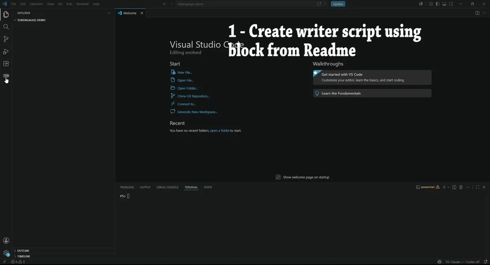
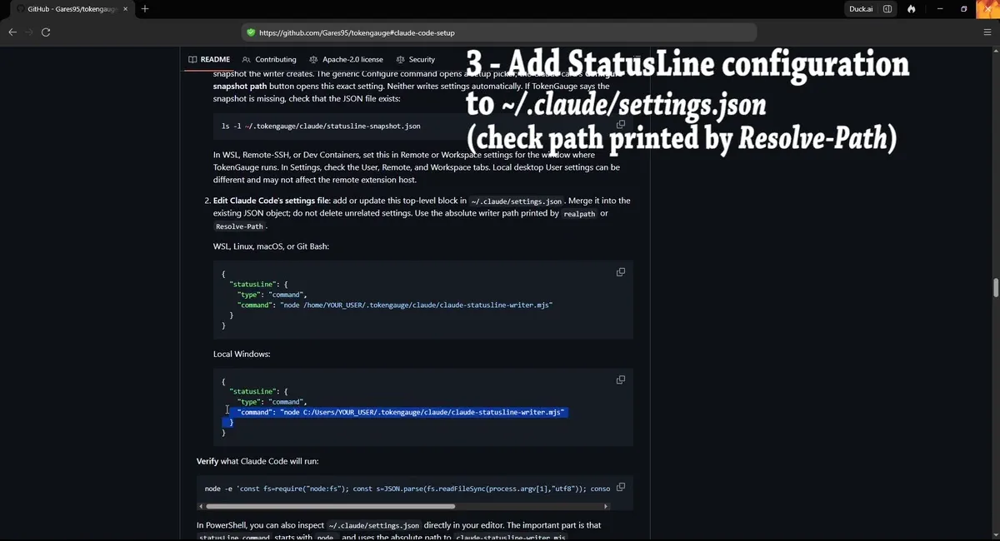
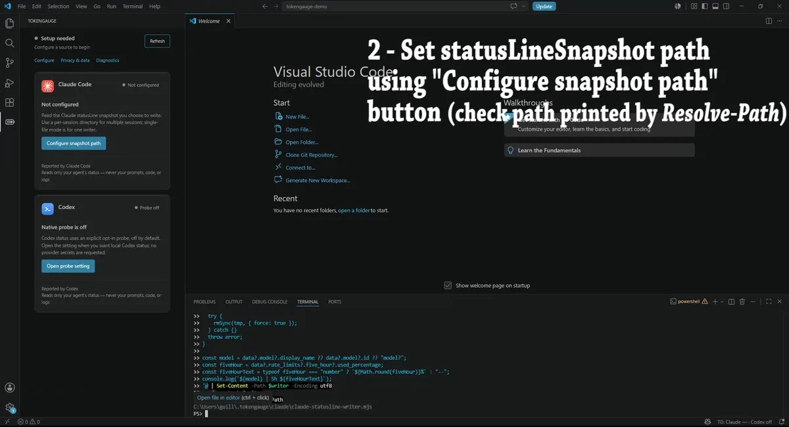
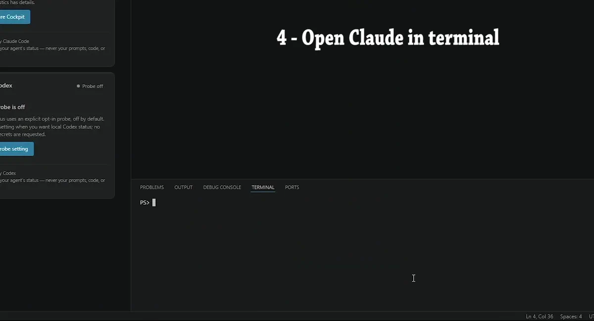

# TokenGauge setup on Windows (PowerShell)

This guide is for **local Windows VS Code**: Claude Code, Node.js, the writer
script, the snapshot file, and the TokenGauge extension host all run in the
same local Windows environment. PowerShell is the shell used throughout.

**Evidence note for this guide.** Every writer and inspection command below was
executed at CLI level in Windows PowerShell 5.1 with Windows Node on NTFS
(file mode, directory mode, paths with spaces, drive-letter paths with both
backslashes and forward slashes, replacement of existing snapshots, and
malformed-input rejection). The complete flow of the **Windows VS Code
extension host reading the snapshot** is supported by the product contract but
was **not verified end to end in this remediation**; if the cockpit does not
pick up a snapshot you verified on disk, use the troubleshooting section and
Cockpit Diagnostics.

## Prerequisites

- Claude Code running as a CLI in this same Windows environment (if `claude`
  does not start in PowerShell, fix Claude Code first).
- Node.js installed on Windows (`node --version` must work in PowerShell).
  TokenGauge does not install Node or Claude Code.
- VS Code with TokenGauge installed, running as a local window (not a
  Remote/WSL window — for WSL, use the [Remote WSL guide](wsl.md)).

> **Visual walkthrough note:** these captures illustrate the setup flow, but
> some frames show an earlier writer version. Do not copy code or commands
> from the images or animations. Use the current commands and writer blocks
> in this guide and the README.

## 1. Create the writer

Use the PowerShell writer block in the README's
**Claude Code setup** section (the `#### PowerShell` block). It creates
`$HOME\.tokengauge\claude\claude-statusline-writer.mjs`, validates it with
`node --check $writer`, and prints the absolute path with
`(Resolve-Path $writer).Path`. That README block is the tested single source
of the writer; this guide intentionally does not carry a second copy of the
writer body.

<details>
<summary>Animation: creating and validating the writer in PowerShell (illustrative)</summary>



Static fallback: [create-writer still (PNG)](../images/setup/windows/windows-claude-create-writer.png).

</details>

## 2. Wire Claude Code's statusLine command

Merge a `statusLine` object into your Windows `~/.claude/settings.json`
(that is, `C:\Users\YOUR_USER\.claude\settings.json`), using the absolute
writer path printed by `Resolve-Path`:

```json
{
  "statusLine": {
    "type": "command",
    "command": "node C:/Users/YOUR_USER/.tokengauge/claude/claude-statusline-writer.mjs --file C:/Users/YOUR_USER/.tokengauge/claude/statusline-snapshot.json"
  }
}
```

Windows path notes, all exercised at CLI level in this remediation:

- Forward slashes (`C:/Users/...`) and backslashes (`C:\Users\...`) both work
  for the writer's `--file`/`--dir` targets. Forward slashes avoid JSON
  escaping, so they are used in the examples.
- A target path containing spaces works when the whole command path is quoted.
  Prefer space-free locations such as `C:/Users/YOUR_USER/.tokengauge/...` so
  the `statusLine.command` string stays simple.
- The writer replaces an existing snapshot atomically (same-directory
  temporary file plus rename) and leaves no temporary files behind. File
  permissions are applied best-effort: the strict `0o600`/`0o700` modes are a
  POSIX feature, and Windows ACLs are not modified by the writer — this is
  designed behavior, not a POSIX permission guarantee.

<details>
<summary>Animation: editing settings.json (illustrative)</summary>



Static fallback: [statusLine settings still (PNG)](../images/setup/windows/windows-claude-statusline-settings.png).

</details>

## 3. Point TokenGauge at the snapshot

Set `tokenGauge.claude.statuslineSnapshotPath` (User settings in a local
window) to the snapshot **output** path, for example
`C:/Users/YOUR_USER/.tokengauge/claude/statusline-snapshot.json` — the JSON
the writer produces, not the writer script itself.

<details>
<summary>Animation: setting the snapshot path (illustrative)</summary>



Static fallback: [snapshot path still (PNG)](../images/setup/windows/windows-claude-snapshot-path.png).

</details>

## Directory mode (multiple Claude sessions)

For several concurrent Claude Code sessions, use one snapshot per session:
pass `--dir` instead of `--file` and point TokenGauge at the directory:

```json
{
  "statusLine": {
    "type": "command",
    "command": "node C:/Users/YOUR_USER/.tokengauge/claude/claude-statusline-writer.mjs --dir C:/Users/YOUR_USER/.tokengauge/claude/statusline-snapshots"
  }
}
```

Then set `tokenGauge.claude.statuslineSnapshotPath` to
`C:/Users/YOUR_USER/.tokengauge/claude/statusline-snapshots`.

Directory-mode behavior (same on every platform): TokenGauge reads only that
exact directory, non-recursively; it considers up to 32 hash-named snapshot
files; it treats files rewritten within about 90 seconds as active; and it
never deletes snapshot files. The writer derives each filename from hashed
identifiers, so no raw session or workspace value appears in the filename.
Directory mode is poll-only — updates appear on the next poll (at most about
15 seconds), while single-file mode also watches the exact configured file.

## 4. Verify

Check what Claude Code will run. In PowerShell, single-quoted `node -e`
programs containing double quotes do **not** survive PowerShell 5.1 argument
quoting, so use this form (outer double quotes, single quotes inside the
JavaScript), which was executed and verified in this remediation:

```powershell
node -p "JSON.parse(require('fs').readFileSync(process.argv[1],'utf8')).statusLine?.command ?? ''" "$HOME\.claude\settings.json"
```

It prints the configured `statusLine.command` only — a structural inspection
that never dumps the rest of your settings. After the next Claude Code
response, confirm the snapshot file (or a hash-named file in the snapshot
directory) exists and has a recent modification time.

<details>
<summary>Animation: the Claude card going live (illustrative)</summary>



Static fallback: [Claude live still (PNG)](../images/setup/windows/windows-claude-live.png).

</details>

## Troubleshooting

- The writer's failure output is content-free by design: on malformed or
  leaky input it exits nonzero with `TokenGauge statusline writer error: ...`
  and never echoes the payload. Do not "debug" by printing the raw statusLine
  payload — it can contain workspace details; inspect the **snapshot** file
  instead, which carries only allowlisted fields and hashed identifiers.
- If the snapshot exists but the Claude card shows no gauge, run
  **TokenGauge: Cockpit Diagnostics**. `statusline_snapshot_missing_rate_limits`
  means Claude Code did not include 5h/weekly `rate_limits` fields in that
  sample (common outside Pro/Max CLI sessions) — not a path problem.
- If nothing is written at all, re-run the README verification steps
  (`node --check` on the writer, then the inspection command above) and make
  sure Claude Code runs in this same Windows environment.

## Shell and platform notes

- This guide is PowerShell-first. Git Bash on Windows can also run the same
  canonical Node writer, but Git Bash execution was not exercised in this
  remediation and using it does not add POSIX file permissions or Unix tools
  to Windows.
- macOS is not covered by this guide and macOS is not verified in this
  remediation.
