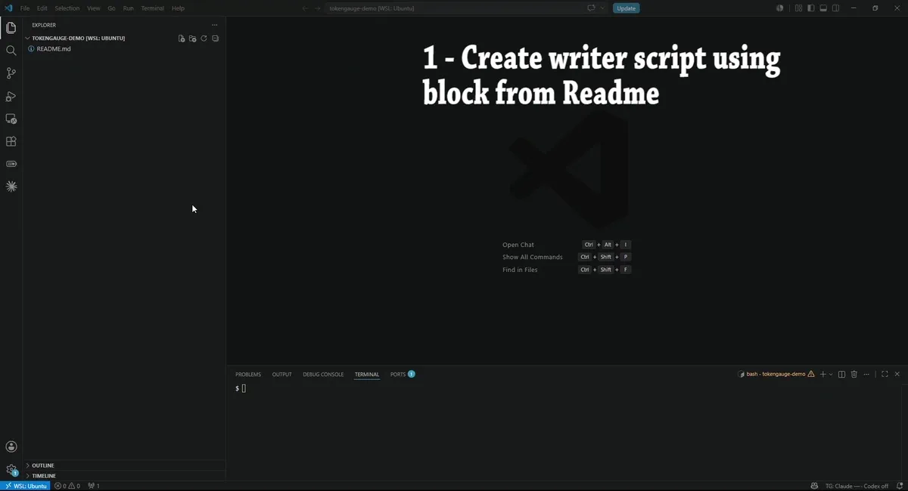
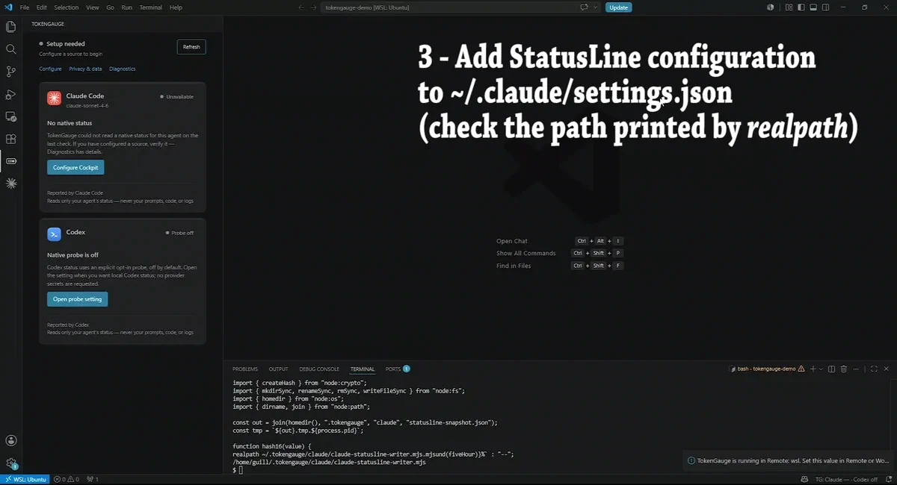
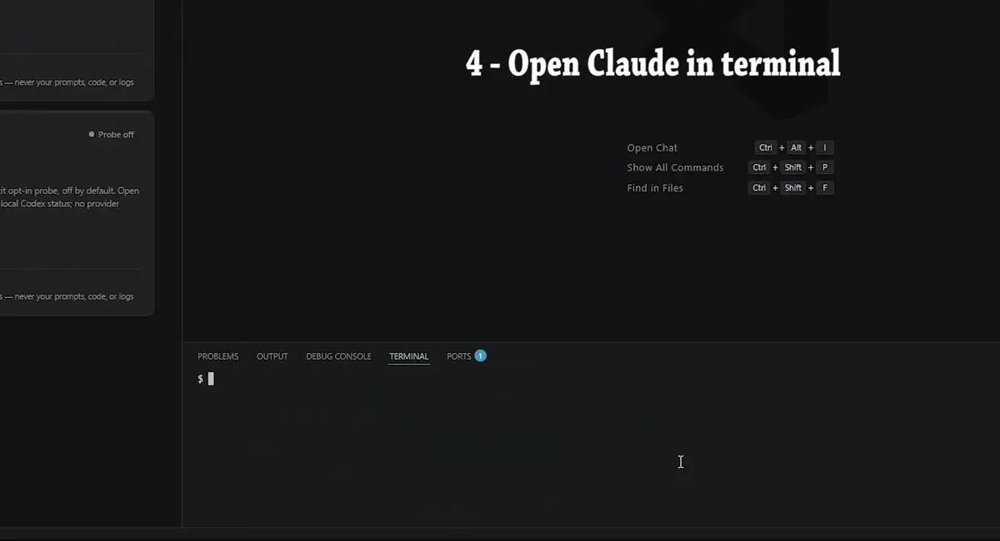
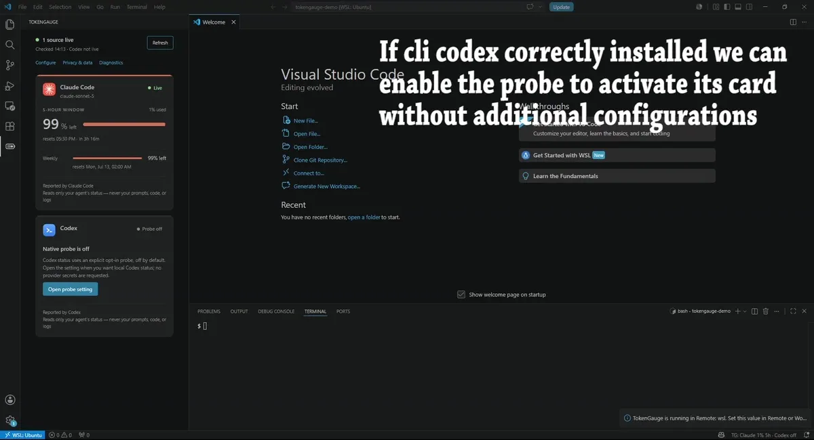

# TokenGauge setup in WSL (Remote WSL)

This guide is for VS Code **Remote WSL** windows: the VS Code client runs on
Windows, but the workspace — and normally the TokenGauge extension host — runs
inside the WSL distro. Claude Code, Node.js, the writer, the snapshot, and the
TokenGauge extension host should all be inside the **same WSL environment**.

**Evidence note for this guide.** The WSL extension-host side of this setup —
the canonical writer plus TokenGauge's live snapshot readers, in both file and
directory modes, on the WSL Linux filesystem — was executed end to end in a
WSL2 environment in this remediation (a WSL2 distro on ext4; native
non-WSL Linux distributions were not separately exercised and path handling
there is designed to be portable). The Windows-side VS Code **client** UI half
of the Remote WSL topology is described here but was not separately driven;
what matters for reading snapshots is the extension host, and that is the part
executed.

## Where things run

Two different machines-in-one matter here:

- the **Windows client**: the VS Code window, running on Windows;
- the **WSL extension host**: where workspace extensions such as TokenGauge
  actually execute in a Remote WSL window.

Use **Developer: Show Running Extensions** to confirm TokenGauge runs on the
WSL side. The rule that decides every path question: **the configured snapshot
path must be visible to the extension host that reads it.** In a Remote WSL
window that means WSL-side paths like `/home/YOUR_USER/...`, resolved against
the WSL home — not your Windows profile.

Inside WSL, use the **Linux** Node installed in the distro (`node --version`
inside a WSL terminal), not Windows Node: Claude Code runs the writer inside
WSL, so the writer must run with WSL's own Node.

> **Visual walkthrough note:** these captures illustrate the setup flow, but
> some frames show an earlier writer version. Do not copy code or commands
> from the images or animations. Use the current commands and writer blocks
> in this guide and the README.

## 1. Create the writer (inside WSL)

Use the Bash-like writer block in the README's **Claude Code setup** section
(the `#### WSL, Linux, macOS, or Git Bash` block) from a WSL terminal. It
creates `~/.tokengauge/claude/claude-statusline-writer.mjs`, validates it with
`node --check`, and prints the absolute path with `realpath`. That README
block is the tested single source of the writer; this guide intentionally does
not carry a second copy of the writer body.

<details>
<summary>Animation: creating and validating the writer inside WSL (illustrative)</summary>



Static fallback: [create-writer still (PNG)](../images/setup/wsl/wsl-claude-create-writer.png).

</details>

## 2. Wire Claude Code's statusLine command (WSL settings)

Edit the **WSL** file `~/.claude/settings.json` (inside the distro) and merge:

```json
{
  "statusLine": {
    "type": "command",
    "command": "node /home/YOUR_USER/.tokengauge/claude/claude-statusline-writer.mjs --file /home/YOUR_USER/.tokengauge/claude/statusline-snapshot.json"
  }
}
```

Verify what Claude Code will run with the same Node one-liner the README uses
(Bash syntax, run inside WSL):

```bash
node -e 'const fs=require("node:fs"); const s=JSON.parse(fs.readFileSync(process.argv[1],"utf8")); console.log(s.statusLine?.command ?? "")' ~/.claude/settings.json
```

<details>
<summary>Animation: editing the WSL settings.json (illustrative)</summary>



Static fallback: [statusLine settings still (PNG)](../images/setup/wsl/wsl-claude-statusline-settings.png).

</details>

## 3. Point TokenGauge at the snapshot (Remote settings)

In the Remote WSL window, set `tokenGauge.claude.statuslineSnapshotPath` to
`/home/YOUR_USER/.tokengauge/claude/statusline-snapshot.json` using **Remote
settings** or Workspace settings — the scope the WSL extension host actually
reads. Local Windows User settings may not affect the remote TokenGauge
instance; this scope split is normal VS Code behavior (use
**Preferences: Open Remote Settings (JSON)**).

<details>
<summary>Animation: setting the snapshot path in Remote settings (illustrative)</summary>


Static fallback: [snapshot path still (PNG)](../images/setup/wsl/wsl-claude-snapshot-path.png).

</details>

<details>
<summary>Animation: the Claude card going live in a Remote WSL window</summary>



Static fallback: [Claude live still (PNG)](../images/setup/wsl/wsl-claude-live.png).

</details>

## Directory mode (multiple Claude sessions)

For several concurrent Claude Code sessions in WSL, write one snapshot per
session: pass `--dir /home/YOUR_USER/.tokengauge/claude/statusline-snapshots`
in `statusLine.command` and point
`tokenGauge.claude.statuslineSnapshotPath` at that same directory.

Directory-mode behavior (same on every platform): TokenGauge reads only that
exact directory, non-recursively; it considers up to 32 hash-named snapshot
files; it treats files rewritten within about 90 seconds as active; and it
never deletes snapshot files. Filenames are derived from hashed identifiers —
no raw session or workspace value appears on disk. Directory mode is
poll-only — updates appear on the next poll (at most about 15 seconds), while
single-file mode also watches the exact configured file. Both modes were
executed against the live readers in WSL in this remediation.

## Filesystem placement and `/mnt/<drive>` caveat

Keep the writer and the snapshot on the WSL Linux filesystem
(`/home/YOUR_USER/...`). Paths under `/mnt/c/...` (the mounted Windows drive)
are visible from WSL and may work, but they are **not the recommended
location** and were not exercised in this remediation: the 9P mount has
different permission semantics, and file modification times drive the
directory-mode ~90-second activity window, so cross-boundary timestamp
behavior can shift freshness judgments. The same visibility rule also means a
WSL snapshot under `/home/...` is for the **WSL** extension host — a local
Windows VS Code window cannot be assumed to read it; for local Windows use the
[Windows guide](windows.md).

## Troubleshooting

- Confirm TokenGauge's host with **Developer: Show Running Extensions**; if it
  runs on the WSL side, every path in this guide must be a WSL path.
- The writer's failure output is content-free by design: malformed or leaky
  input exits nonzero with `TokenGauge statusline writer error: ...` and never
  echoes the payload. Inspect the **snapshot** file (allowlisted fields plus
  hashed identifiers only) rather than printing raw statusLine payloads.
- If the snapshot exists but the Claude card shows no gauge, run
  **TokenGauge: Cockpit Diagnostics** and check for
  `statusline_snapshot_missing_rate_limits` — Claude Code did not report
  limit fields in that sample; this is not a path problem.
- macOS is not covered by this guide and macOS is not verified in this
  remediation.

## Optional: enabling the Codex probe

The Codex card uses an explicit opt-in probe (off by default; see the README
Codex section for the current steps). This capture, recorded in a Remote WSL
window, shows what enabling it looks like:

<details>
<summary>Animation: enabling the Codex native status probe</summary>



Static fallback: [Codex probe still (PNG)](../images/setup/shared/codex-enable-probe.png).

</details>
